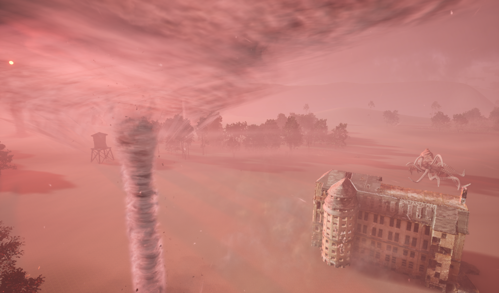

# UE_P4000_Game — UE P4000: AI-Driven NPC Behavior Research (Unreal Engine)

<p align="center">
  
  <br />
  
</p>

A research-driven Unreal Engine project exploring how players perceive and interact with NPCs that exhibit different competencies and behaviors in a harsh sci‑fi world set on Earth in the year 4000.

[Play on itch.io →](https://p4000.itch.io)

[](https://www.linkedin.com/in/pejman-ebrahimi-4a60151a7/)
[](https://huggingface.co/arad1367)
[](https://arad1367.github.io/pejman-ebrahimi/)
[](https://www.uni.li/pejman.ebrahimi?set_language=en)

---

## Setting

Earth, circa the year 4000. Environmental degradation has reshaped the planet into sweeping deserts and dust-choked plains. Superheated air crackles with frequent lightning, the sun looms larger in the sky, and the moon is often visible in tandem. Among the dunes, kraken‑like alien entities have appeared, challenging the last pockets of humanity.

This project uses that setting as a testbed to study how different AI behaviors influence player experience.

## Core Features

- Distinct NPC archetypes ranging from fast and aggressive to slow and aloof — including some that ignore the player entirely, even when attacked. This variety is deliberate to study perception across competency levels.
- Handcrafted environment with high‑quality materials to create a visually rich, hostile atmosphere (dust, deserts, thunders, storm, lightning/electrical effects).
- Built with Unreal Engine AI Behavior Trees and Blackboards for modular, explainable NPC decision‑making.
- Animation system powered by Blend Spaces and State Machines to ensure fluid locomotion and readable state transitions.

## AI System Overview

This project uses Unreal Engine’s AI Behavior Tree (BT) framework with a Blackboard to coordinate decision‑making:

- Behavior Tree building blocks: Selectors and Sequences orchestrate tasks like Patrol → Investigate → Chase → Attack. Decorators gate transitions (for example, “HasLineOfSight == true”), while Services refresh knowledge (for example, updating last known player location).
- Blackboard examples: Common keys include `TargetActor`, `HasLineOfSight`, `LastKnownLocation`, `Alertness`, `MoveSpeed`, and `Aggression`. These keys are read by Tasks and Decorators to drive branching behavior in the BT.
- Perception and movement: AI Perception (e.g., AISense_Sight) and NavMesh-pathfinding enable sensing and navigation; speed/rotation parameters are exposed per archetype to produce visibly different personalities.

### NPC Archetypes (examples)

- Swift Hunter: Very fast pursuit and short reaction times.
- Tactical Stalker: Prioritizes cover, flanks more frequently, and reacts to the player’s last known position.
- Wary Drifter: Moves slowly with delayed reactions and larger perception thresholds.
- Passive Monolith: Does not move or retaliate, even when attacked (included intentionally for hypothesis testing around perceived competence and challenge).

## Animation Pipeline

- Blend Spaces: 1D/2D blend spaces (for example, Speed and Direction) ensure locomotion transitions are smooth across idle, walk, jog, and run.
- Animation State Machine: Clearly defined states (Idle, Move, Turn, Aim/Alert, React/Hit) with guarded transitions using animation notifies and gameplay conditions. This keeps character readability high while allowing expressive, state‑driven motion.

## Research Design

We are investigating how players interpret and value different NPC competencies and responses when placed in the same world context.

- Gamification model: The experience is structured to balance engagement with experimental control, so we can compare behaviors without confounding the player’s goals.
- Hypotheses (high level): Variations in NPC speed, intelligence, and reactivity will alter perceived difficulty, immersion, and trust in the AI, which we will measure through player self‑reports.
- Study flow: Participants complete short pre‑ and post‑play questionnaires (hosted on Prolific) capturing expectations, perceived challenge/competence, emotion/immersion, and qualitative feedback.
- Data and ethics: Only anonymous gameplay metrics are collected; no personally identifying information is stored. Aggregate analyses will be reported in publications where applicable.

If you are participating via Prolific, please follow the instructions provided with your study link.

## Screenshots

<p align="center">
  
  
  
</p>
<p align="center">
  
  
  
</p>
<p align="center">
  
</p>

## Getting Started

### Option A — Play the build

- Download/play on itch.io: https://p4000.itch.io
- Recommended: Windows for the best performance.

### Option B — Open the project in Unreal Engine (Not available now)

1. Clone this repository.
2. Open the `.uproject` in Unreal Engine (update this README with your exact UE version).
3. Ensure that AI and Navigation (Nav Mesh) are enabled in your level and project settings.
4. Press Play in the editor.

> Note: If assets fail to load, right‑click the Content folder in the Content Browser and choose “Fix Up Redirectors,” then recompile shaders as needed.

## System Requirements (suggested)

- Windows 10/11 recommended for best performance.
- A mid‑range GPU is suggested due to high‑quality materials and post‑processing.
- 8–16 GB RAM minimum depending on selected quality settings.

## Repository Structure (selected)

```
UE_P4000_Game/
├─ banner/
│  ├─ BannerMain2.webp
│  └─ Banner2.webp
├─ image/
│  ├─ SC21.png SS1.png SS2.png SC11.png SC9.png SC@.png SC1.png
└─ (Unreal project files and Content/…)
```

## Roadmap

- Expand NPC archetypes and difficulty profiles.
- Extend Behavior Tree branches for contextual reactions (threat tiering, retreat, regroup).
- Add more environment set‑pieces and dynamic hazards.
- Publish anonymized aggregate results of the study when available.

## Citation

If you use UE P4000 in academic or industry research, please cite this repository. A BibTeX entry will be provided with the corresponding paper/preprint.

## Contact

Created by: **Pejman Ebrahimi**  
Email: **pejman.ebrahimi77@gmail.com**

## License

Apache‑2.0

